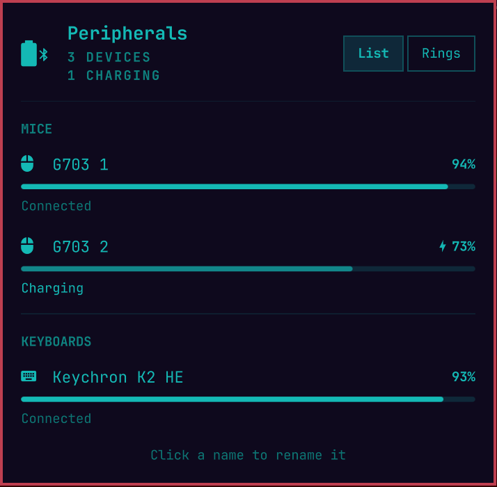

# Peripheral Battery Indicator

Battery levels for your wireless **mouse, keyboard, headset & controllers**,
right in the Omarchy bar. A single battery-bluetooth icon sits in the bar and
turns amber then red as something runs low; click it for a popup listing
every device with its charge, and get a desktop notification before a
device dies. Hover the bar icon for a quick "Mouse 15%" without opening the
popup.





## Features

- **One tidy bar icon** — `battery-bluetooth` glyph, tinted amber at warning
  and red at critical. No clutter of per-device chips. Hover it for the
  neediest device's name and charge without opening the popup.
- **Native Omarchy panel** — the popup is built on the shell's own panel kit
  (the same `KeyboardPanel` / `PanelHero` / section headers / meters the
  first-party Agents panel uses), so it matches the rest of the shell and
  takes keyboard focus (`Esc` closes, `h`/`l` switches layout, `Tab` moves
  to the neighbouring bar panel).
- **Grouped by type** — a header with the device count and how many are
  charging, then one section per type (Mice, Keyboards, Headsets, …).
- **Two layouts** — switch from the header: **Rings** (cards with a
  round-capped ring gauge and the charge % inside) or **List** (rows with
  a thin meter). A pulsing bolt marks devices that are charging.
- **Rename devices** — click a name, type, `Enter` saves, `Esc` cancels, an
  empty name restores the original. Names are stored per serial number, so
  two identical devices (e.g. two of the same mouse) can be told apart.
- **One entry per device** — a device seen twice at once (e.g. a mouse on
  its receiver *and* its charging cable) is collapsed into a single entry.
- **Multilingual** — English, Português, Español, Français and Deutsch;
  follows the system locale or the `language` setting. Add a language by
  adding a table to `src/Strings.qml`.
- **Two-tier notifications** — normal urgency at the warning threshold,
  critical urgency below that; re-armed on recharge, with an optional
  repeat while still low so you don't miss it.

## Install

```bash
omarchy plugin add https://github.com/hlasensky/omarchy-peripheral-battery.git --enable
```

Plugins land **disabled** until you review them; `--enable` opts in. It drops
into the bar's right section — move it with `omarchy bar move
hl.peripheral_battery --section <left|center|right>`.

## Update

```bash
omarchy plugin update hl.peripheral_battery
```

## Uninstall

```bash
omarchy plugin remove hl.peripheral_battery
```

This disables the widget, removes it from the bar (`shell.json`), and deletes
the plugin from `~/.config/omarchy/plugins/`.

## Requirements

- `upower` (ships with Omarchy).
- A C compiler (ships with Omarchy) to build the Steam Controller 2 helper once.
- The device must report battery to UPower. Most USB-dongle and Bluetooth
  peripherals do; some BT headsets need the experimental BlueZ battery plugin.
  The 2026 Steam Controller is also supported directly over USB or its puck
  when `steam-devices` grants access to Valve HID devices.
- A Nerd Font as the bar font (Omarchy default) — the icons are Nerd Font
  glyphs.

## Settings

Edit the widget's entry in `~/.config/omarchy/shell.json` (find it under
`hl.peripheral_battery`); the shell hot-reloads on save, no restart needed.

```bash
omarchy launch config-editor ~/.config/omarchy/shell.json
```

| Key                    | Type        | Default                            | What it does                              |
|------------------------|-------------|-------------------------------------|-------------------------------------------|
| `displayStyle`         | enum        | Gauge                               | Popup layout: `Gauge` (Rings cards) or `List` (rows with a linear meter); also switchable from the popup header |
| `language`             | enum        | auto                                | UI language: `auto` (system locale), `en`, `pt`, `es`, `fr`, `de` |
| `deviceNames`          | object      | `{}`                                | Per-device overrides keyed by serial (Bluetooth: MAC): `"name"` or `{ "name": "…", "type": "mouse" }`. Written by the rename UI; `type` fixes devices UPower misclassifies |
| `lowThreshold`         | integer     | 20                                  | % at/below which a device is "warning"    |
| `criticalThreshold`    | integer     | 10                                  | % at/below which a device is "critical"   |
| `hideLaptopBattery`    | boolean     | true                                | Hide the laptop's own battery             |
| `notifyOnLow`          | boolean     | true                                | Desktop notification on low               |
| `notifyRepeatMinutes`  | integer     | 0                                   | Re-notify every N minutes while still low (0 = once) |
| `deviceTypes`          | multiselect | mouse, keyboard, headset, gamepad   | Which device types to show                |

## How it works

UPower uses one of two data paths, picked automatically at startup:

- **Path A (native):** imports `Quickshell.Services.UPower` and iterates
  `UPower.devices`. Event-driven, zero polling.
- **Path B (fallback):** if that module isn't present, enumerates `upower -e`
  and parses each `upower -i <path>` block. A 30s timer backs it up.

Alongside those paths, a read-only native HID probe handles the 2026 Steam
Controller (`28de:1302`) and puck (`28de:1304`), which do not currently publish
battery data through UPower. It consumes the controller's battery status report
without taking the device away from Steam. The auditable C helper is compiled
once into `~/.cache/omarchy-peripheral-battery/`; subsequent refreshes execute
the small native binary directly.

Serial numbers come from UPower (path B) or `/sys/class/power_supply/*/serial_number`
(path A, whose Quickshell binding doesn't expose them); they key renames and
collapse duplicate entries of the same physical device.

The bar widget (`bar-widget`) and the data source (`service`) are both declared
in `manifest.json`.

## License

MIT — see [LICENSE](LICENSE).
